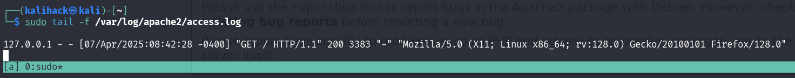
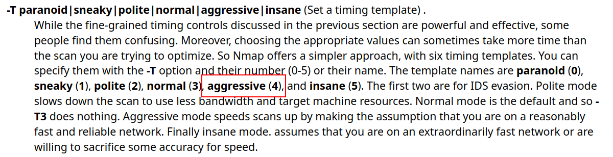

# x) 
### a) Apache log
Ennenkuin tarkastelin omista sivulatauksista syntyneitä lokiviestejä tyhjensin  
lokitiedoston komennolla:
```
$ sudo truncate -s 0 /var/log/apache2/access.log
```
`sudo` kertoo, että suoritetaan komento root-oikeuksilla. Komento tulee      
suorittaa pääkäyttäjän oikeuksilla, sillä /var/log/-hakemisto ja ja sen sisällön   
muokkaus vaatii pääkäyttäjän oikeudet.  

`truncate` on Linux-komento, jolla voidaan muuttaa tiedoston kokoa.  
Komennolle  annettu optio `-s` tarkoittaa tiedoston kokoa ja optiolle määritetty arvo `0`,  
joka tarkoittaa, että asetetaan tiedoston kooksi 0 tavua.

**truncate -s 0** tarkoittaa siis  
aseta /var/log/apache2/access.log tiedoston kooksi 0 tavua.<br>
#### <u> Ajoin komennon</u>
```
$ sudo tail -f /var/log/apache2/access.log
```
Siirryin selaimessa http://localhost ja terminaalissani näkyi tuloste 

Kuva 1. Kuvakaappauksessa sudo tail -f /var/log/apache2/access.log tulostama rivi.

Tuloste on /var/log/apache2/access.log tiedostoon kirjattu lokimerkintä.  

Lokimerkintä kirjattiin siirtyessäni selaimessa Apache-webpalvelimelleni ja  
tuloste näytettiin, sillä **komento tail -f /var/log/apache2/access.log**   
tulostaa tiedoston viimeiset rivit, oletuksena 10 viimeisintä ja optio `-f`  
takoittaa, että tiedoston sisältöä seurataan ja näytetään uutta sisältöä sitä  
mukaan kun tiedostoon kirjoitetaan.  

  
Kuva 2. Kuvakaappauksessa tail-komennon manuaalisivu, avattu komennolla man tail.
Kuvassa korostettuna -f option kuvaus.

Lokimerkinnän ymmärtäminen 

Apache 2.4 dokumentoinnin mukaan tyyppillinen access.log lokirivin formaatti on  
mallia 
```
LogFormat "%h %l %u %t \"%r\" %>s %b" common
```
Lokimerkintä koostuu useasta eri osasta. Seuraavaksi puran lokimerkinnän osiksi 
ja selitän mitä kukin osa tarkoittaa.

`127.0.0.1` vastaa lokiformaatissa `%h`  
ensimmäinen `-` vastaa `%l`  
toinen `-` vastaa `%u`  
`[07/Apr/2025:08:42:28 -0A00]` vastaa `%t`  
`"GET / HTTP/1.1"` vastaa `\"%r\`  
`200` vastaa `%>s`  
`338` vastaa `%b`
```
127.0.0.1 - - [07/Apr/2025:08:42:28 -0A00] "GET / HTTP/1.1" 200 3383 "-" "Mozilla/5.0 (X11; Linux x86_64; rv:128.0) Gecko/20100101 Firefox/128.0"
```

127.0.0.1 asiakkaan ip-osoite, joka teki pyynnön palvelimelle  

ensimmäinen - tarkoittaa asiakkaan RFC 1413 -tunnistetta. kentän arvo on - ,  
sillä arvoa ei ole asetettu  

toinen - on henkilön userid, joka määräytyy HTTP-autentikoinnilla  

[07/Apr/2025:08:42:28 -0A00] kertoo milloin pyyntö vastaanotettiin.  
Ajan muoto on:  
[päivä/kuukausi/vuosi:tunti:minuutti:sekunti aikavyöhyke]  

"GET / HTTP/1.1" on pyyntörivi, jossa GET on asiakkaan käyttämä HTTP-metodi.  
/ tarkoittaa polkua, eli asiakas asiakas pyytää saada asiakkaan juurihakemiston sisällön.  
HTTP/1.1 on asiakkaan käytössä oleva HTTP-protokollan versio.  

200 on tilakoodi, jonka palvelin lähettää takaisin asiakkaalle.  
Tilakoodista voidaan päätellä onnistuiko pyyntö vai ei.  
Tilakoodi 2xx kertoo pyynnön onnistuneen.

Viimeinen osa, tässä tapauksessa 3383 kertoo palvelimen asiakkaalle palauttaman tiedoston koon tavuina ilman HTTP-vastauksen otsikkotietoja.

Yhteenvetona siis, että Apache-webpalvelimelle saapuvista HTTP-pyynnöistä jää 
merkintä lokitiedostoon ja lokimerkinnät voivat sisältää paljon hyödyllistä tietoa.

# b)
Nmap on avoimen lähdekoodin työkalu, jota käytetään verkon kartoituksessa, turvallisuustarkistuksissa sekä palveluiden tunnistamisessa (Nmap s.a).  

Ajoin komennon porttiskannatakseni oman webpalvelimen:
```
$ sudo nmap -T4 -A -p 80 localhost
```
`-T4` optio määrittää skannauksen ajastuksen

Kuva 3. Kuvakaappauksessa Linux Man Page nmap -T option kuvaus. Kuvakaappaus  
otettu sivulta https://linux.die.net/man/1/nmap  

`-T` optiolla säädellään skannauksen tiheyttä. Tyypillisesti `-T0` ja `-T1` käytetään, 
kun halutaan välttyä IDS-järjestelmien (engl. Intrusion Detection Systems) (Linux Man Page s.a). 

`-A` optio ottaa käyttöön käyttöjärjestelmän tunnistuksen, version tunnistuksen,  
skriptiskannauksen ja reittiseurannan.
  
Kuva 4. Kuvakaappauksessa Linux Man Page nmap -A option kuvaus. Kuvakaappaus otettu sivulta https://linux.die.net/man/1/nmap

`-p` optio rajoittaa skannauksen tiettyihin portteihin. Kyseiselle optiolle on 
annettu arvoksi `80`, jolloin skannaus suoritetaan vain porttiin 80.
  
Kuva 5. Kuvakaappauksessa Linux Man Page nmap -p option kuvaus. Kuvakaappaus otettu sivulta https://linux.die.net/man/1/nmap  
  
  `localhost` on kohde johon skannaus suoritetaan.

Seuraavaksi analysoin komennon `sudo nmap -T4 -A -p 80 localhost` tulostetta.

  
Kuva 6. Kuvakaappaus sudo nmap -T4 -A -p 80 localhost tulosteesta  

Skannauksesta käy ilmi useita tietoja, kuten HTTP-palvelun tiedot
  

Skannattu portti 80 on auki ja palvelin on Apahche HTTP-palvelinohjelmisto,  
jonka käyttöjärjestelmä on Debian
# c)
# d)
# e)
# f)
# g)
# h)
# i)
# j)

 
 
 
 
 
 
 
 
 
