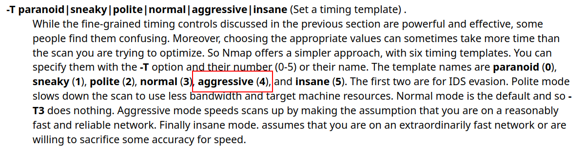

# x) 
### a) Apache log
Ennenkuin tarkastelin omista sivulatauksista syntyneitä lokiviestejä tyhjensin  
lokitiedoston komennolla:
```
$ sudo truncate -s 0 /var/log/apache2/access.log
```
`sudo` kertoo, että suoritetaan komento root-oikeuksilla. Komento tulee      
suorittaa pääkäyttäjän oikeuksilla, sillä /var/log/-hakemisto ja ja sen sisällön   
muokkaus vaatii pääkäyttäjän oikeudet.  

`truncate` on Linux-komento, jolla voidaan muuttaa tiedoston kokoa.  
Komennolle  annettu optio `-s` tarkoittaa tiedoston kokoa ja optiolle määritetty arvo `0`,  
joka tarkoittaa, että asetetaan tiedoston kooksi 0 tavua.

**truncate -s 0** tarkoittaa siis  
aseta /var/log/apache2/access.log tiedoston kooksi 0 tavua.<br>
### Ajoin komennon
```
$ sudo tail -f /var/log/apache2/access.log
```
Siirryin selaimessa http://localhost ja terminaalissani näkyi tuloste 

Kuva 1. Kuvakaappauksessa sudo tail -f /var/log/apache2/access.log tulostama rivi.

Tuloste on /var/log/apache2/access.log tiedostoon kirjattu lokimerkintä.  

Lokimerkintä kirjattiin siirtyessäni selaimessa Apache-webpalvelimelleni ja  
tuloste näytettiin, sillä **komento tail -f /var/log/apache2/access.log**   
tulostaa tiedoston viimeiset rivit, oletuksena 10 viimeisintä ja optio `-f`  
takoittaa, että tiedoston sisältöä seurataan ja näytetään uutta sisältöä sitä  
mukaan kun tiedostoon kirjoitetaan.  

  
Kuva 2. Kuvakaappauksessa tail-komennon manuaalisivu, avattu komennolla man tail.
Kuvassa korostettuna -f option kuvaus.

Lokimerkinnän ymmärtäminen 

Apache 2.4 dokumentoinnin mukaan tyyppillinen access.log lokirivi on  
tyypillisesti muotoa `"%h %l %u %t \"%r\" %>s %b \"%{Referer}i\" \"%{User-agent}i\"`


Lokimerkintä koostuu useasta eri osasta. Seuraavaksi puran lokimerkinnän osiksi 
ja selitän mitä kukin osa tarkoittaa.  

Kenttien merkitykset on tulkittu Apache HTTP Server -dokumentaation mukaisesti.  
Kopio manuaalin tekstistä saatavilla https://httpd.apache.org/docs/2.4/en/logs.html    

+ `127.0.0.1` = `%h`  

+ `-` = `%l`  

+ `-` = `%u`  

+ `[07/Apr/2025:08:42:28 -0A00]` = `%t`  

+ `"GET / HTTP/1.1"` = `\"%r\`  

+ `200` = `%>s`  

+ `338` = `%b`  

+ `"-"` = `\"%{Referer}i\"`  

+ `(X11; Linux x86_64; rv:128.0) Gecko/20100101 Firefox/128.0"` = `\"%{User-agent}i\"`  
<br>

### Lokirivin sisältö purettuna
```
127.0.0.1 - - [07/Apr/2025:08:42:28 -0A00] "GET / HTTP/1.1" 200 3383 "-" "Mozilla/5.0 (X11; Linux x86_64; rv:128.0) Gecko/20100101 Firefox/128.0"
```

127.0.0.1 asiakkaan ip-osoite, joka teki pyynnön palvelimelle.  

Lokirivin ensimmäinen `-` tarkoittaa asiakkaan RFC 1413 -tunnistetta. Kentän arvo on - ,  
sillä arvoa ei ole asetettu.    

Toinen `-` on henkilön userid, joka määräytyy HTTP-autentikoinnilla.  

`[07/Apr/2025:08:42:28 -0A00]` kertoo milloin pyyntö vastaanotettiin.  
Ajan muoto on:  
[päivä/kuukausi/vuosi:tunti:minuutti:sekunti aikavyöhyke]  

`"GET / HTTP/1.1"` on pyyntörivi, jossa GET on asiakkaan käyttämä HTTP-metodi.  
`/` tarkoittaa polkua, eli asiakas asiakas pyytää saada asiakkaan juurihakemiston sisällön.  
`HTTP/1.1` on asiakkaan käytössä oleva HTTP-protokollan versio.  

`200` on tilakoodi, jonka palvelin lähettää takaisin asiakkaalle.  
Tilakoodista voidaan päätellä onnistuiko pyyntö vai ei.  
Tilakoodi 2xx kertoo pyynnön onnistuneen.

`3383` kertoo palvelimen asiakkaalle palauttaman tiedoston koon tavuina ilman HTTP-vastauksen otsikkotietoja.  

Jonka jälkeen oleva `"-"` tarkoittaa referrer, eli miltä sivulta asiakas ohjattiin. Tässä refererr kenttä on tyhjä ja merkattu arvolla -.  

`user-agent`-kentässä näkyy "Mozilla/5.0 (X11; Linux x86_64; rv:128.0)  
Gecko/20100101 Firefox/128.0", joka kertoo millä selaimella ja käyttöjärjestelmällä  
pyyntö tehtiin (Apache HTTP Server Documentation).

Yhteenvetona siis, että Apache-webpalvelimelle saapuvista HTTP-pyynnöistä jää 
merkintä lokitiedostoon ja lokimerkinnät voivat sisältää paljon hyödyllistä tietoa.

# b) Nmapped
Nmap on avoimen lähdekoodin työkalu, jota käytetään verkon kartoituksessa, turvallisuustarkistuksissa sekä palveluiden tunnistamisessa (Nmap s.a).  

Ajoin komennon porttiskannatakseni oman webpalvelimen:
```
$ sudo nmap -T4 -A -p 80 localhost
```
`-T4` optio määrittää skannauksen ajastuksen

Kuva 3. Kuvakaappauksessa Linux Man Page nmap -T option kuvaus. Kuvakaappaus  
otettu sivulta https://man7.org/linux/man-pages/man1/nmap.1.html 

`-T` optiolla säädellään skannauksen tiheyttä. Tyypillisesti `-T0` ja `-T1` käytetään, 
kun halutaan välttyä IDS-järjestelmien (engl. Intrusion Detection Systems) (Linux Man Page s.a). 

`-A` optio ottaa käyttöön käyttöjärjestelmän tunnistuksen, version tunnistuksen,  
skriptiskannauksen ja reittiseurannan.

Kuva 4. Kuvakaappauksessa Linux Man Page nmap -A option kuvaus. Kuvakaappaus otettu sivulta https://man7.org/linux/man-pages/man1/nmap.1.html

`-p` optio rajoittaa skannauksen tiettyihin portteihin. Kyseiselle optiolle on 
annettu arvoksi `80`, jolloin skannaus suoritetaan vain porttiin 80.
 
Kuva 5. Kuvakaappauksessa Linux Man Page nmap -p option kuvaus. Kuvakaappaus otettu  
sivulta https://man7.org/linux/man-pages/man1/nmap.1.html
  
  `localhost` on kohde johon skannaus suoritetaan.

Kopio manuaalin teksistä luettavissa:  
https://man7.org/linux/man-pages/man1/nmap.1.html

Seuraavaksi analysoin komennon `sudo nmap -T4 -A -p 80 localhost` tulostetta.

  
Kuva 6. Kuvakaappaus sudo nmap -T4 -A -p 80 localhost tulosteesta  

Seuraavaksi havainnoin suorittamani porttiskannauksen tulostetta.

Skannauksesta käy ilmi, että portti 80 on auki ja palvelin on Apahche  
HTTP-palvelinohjelmisto, jonka käyttöjärjestelmä on Debian.
  
Kuva 7. Kuvakaappauksessa sudo nmap -T4 -A -p 80 localhost tulosteen HTTP-tiedoja  
 
  
Kuva 8. Skannatun sivun otsikko
  
  
Kuva 9. Kohteen laite on yleiskäyttöinen tietokone
  
  
Kuva 10. Käyttöjärjestelmä arvio: Käyttöjärjestelmä on 2.6-sarjan ydin tai  
5.x-sarjan ydin  

  
Kuva 11. Linux ydinversio  

  
Kuva 12. Verkkoetäisyys 0 hyppyä, koska skannaus suoritettiin paikallisesti  

# c) Skriptit
`-A` suorittaa seuraavat skriptit:  
`-O` käyttöjärjestelmän tunnistus  
`-sV` version skannaus  
`-sC` skriptiskannaus  
`--traceroute`  

  
Kuva 13. Kuvakaappauksessa -A option kuvaus, jossa mainitaan mitä skriptejä se  
suorittaa. Kuvakaappaus otettu sivulta https://man7.org/linux/man-pages/man1/nmap.1.html

`-A` option on tarkoitus asettaa sarja skannausasetuksia, jotta käyttäjän ei tarvitsee muistaa montaa optiota (Linux Man Pages s.a).

Kopio manuaalin teksistä luettavissa:  
https://man7.org/linux/man-pages/man1/nmap.1.html
# e)
# f)
# g)
# h)
# i)
# j)  
# Lähteet
Linux manual pages s.a. - nmap(1) - Linux manual page  
Luettavissa: https://man7.org/linux/man-pages/man1/nmap.1.html. Luettu: 5.4.2025


 
 
 
 
 
 
 
 
 
