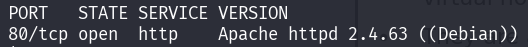
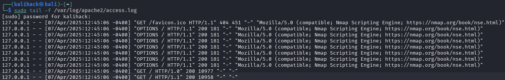
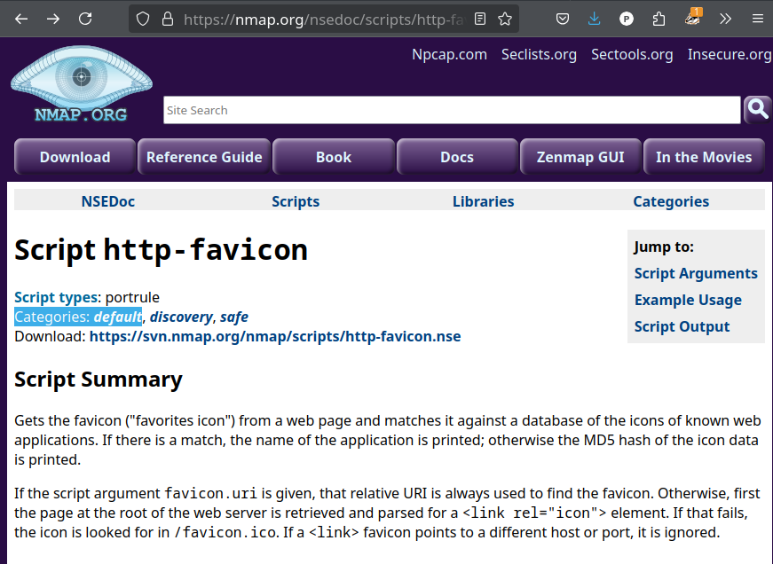

# x) Tuskan pyramidi & timanttimalli
Tuskan pyramidin ideana on mallintaa hyökkäyksen tunnistuskeinoja sekä sitä, kuinka  
paljon haittaa eli "tuskaa" ne aiheuttavat hyökkääjälle, kun puolustaja havaitsee  
ja estää ne. Mitä korkeammalle pyramidissa mennään, sitä enemmän tuskaa hyökkääjälle  
aiheutuu.  

Timanttimalli kuvastaa hyökkäystapahtuman neljää toisiinsa liittyvää elementtiä: vastustaja, kyvykkyys, infrastruktuuri ja uhri. Mallia käytetään analysoimaan elementtien välisiä suhteita haitallisen toiminnan ymmärtämiseksi ja torjumiseksi.
### a) Apache log
Ennenkuin tarkastelin omista sivulatauksista syntyneitä lokiviestejä tyhjensin  
lokitiedoston komennolla:
```
$ sudo truncate -s 0 /var/log/apache2/access.log
```
`sudo` kertoo, että suoritetaan komento root-oikeuksilla. Komento tulee      
suorittaa pääkäyttäjän oikeuksilla, sillä /var/log/-hakemisto ja ja sen sisällön   
muokkaus vaatii pääkäyttäjän oikeudet.  

`truncate` on Linux-komento, jolla voidaan muuttaa tiedoston kokoa.  
Komennolle  annettu optio `-s` tarkoittaa tiedoston kokoa ja optiolle määritetty arvo `0`,  
joka tarkoittaa, että asetetaan tiedoston kooksi 0 tavua.

**truncate -s 0** tarkoittaa siis  
aseta /var/log/apache2/access.log tiedoston kooksi 0 tavua.<br>

Ajoin komennon:
```
$ sudo tail -f /var/log/apache2/access.log
```
Siirryin selaimessa http://localhost ja terminaalissani näkyi tuloste.

Kuva 1. Kuvakaappauksessa sudo tail -f /var/log/apache2/access.log tulostama rivi.

Tuloste on /var/log/apache2/access.log tiedostoon kirjattu lokimerkintä.  

Lokimerkintä kirjattiin siirtyessäni selaimessa Apache-webpalvelimelleni ja  
tuloste näytettiin, sillä **komento tail -f /var/log/apache2/access.log**   
tulostaa tiedoston viimeiset rivit, oletuksena 10 viimeisintä ja optio `-f`  
takoittaa, että tiedoston sisältöä seurataan ja näytetään uutta sisältöä sitä  
mukaan kun tiedostoon kirjoitetaan.  

  
Kuva 2. Kuvakaappauksessa tail-komennon manuaalisivu, avattu komennolla man tail.
Kuvassa korostettuna -f option kuvaus.

Lokimerkinnän ymmärtäminen 

Apache 2.4 dokumentoinnin mukaan tyyppillinen access.log lokirivi on  
tyypillisesti muotoa `"%h %l %u %t \"%r\" %>s %b \"%{Referer}i\" \"%{User-agent}i\"`

  
Kuva 3. Kuvakaappauksessa Apache lokirivin formaatti. Kuvakaappaus otettu sivulta  
https://httpd.apache.org/docs/2.4/en/logs.html 

Lokimerkintä koostuu useasta eri osasta. Seuraavaksi puran lokimerkinnän osiksi 
ja selitän mitä kukin osa tarkoittaa.  

Kenttien merkitykset on tulkittu Apache HTTP Server -dokumentaation mukaisesti.  
Kopio dokumentaation tekstistä saatavilla https://httpd.apache.org/docs/2.4/en/logs.html    

+ `127.0.0.1` = `%h`  

+ `-` = `%l`  

+ `-` = `%u`  

+ `[07/Apr/2025:08:42:28 -0A00]` = `%t`  

+ `"GET / HTTP/1.1"` = `\"%r\`  

+ `200` = `%>s`  

+ `338` = `%b`  

+ `"-"` = `\"%{Referer}i\"`  

+ `(X11; Linux x86_64; rv:128.0) Gecko/20100101 Firefox/128.0"` = `\"%{User-agent}i\"`

#### Lokirivin sisältö purettuna
```
127.0.0.1 - - [07/Apr/2025:08:42:28 -0A00] "GET / HTTP/1.1" 200 3383 "-" "Mozilla/5.0 (X11; Linux x86_64; rv:128.0) Gecko/20100101 Firefox/128.0"
```

127.0.0.1 asiakkaan ip-osoite, joka teki pyynnön palvelimelle.  

Lokirivin ensimmäinen `-` tarkoittaa asiakkaan RFC 1413 -tunnistetta. Kentän arvo on - ,  
sillä arvoa ei ole asetettu.    

Toinen `-` on henkilön userid, joka määräytyy HTTP-autentikoinnilla.  

`[07/Apr/2025:08:42:28 -0A00]` kertoo milloin pyyntö vastaanotettiin.  
Ajan muoto on:  
[päivä/kuukausi/vuosi:tunti:minuutti:sekunti aikavyöhyke]  

`"GET / HTTP/1.1"` on pyyntörivi, jossa GET on asiakkaan käyttämä HTTP-metodi.  
`/` tarkoittaa polkua, eli asiakas asiakas pyytää saada asiakkaan juurihakemiston sisällön.  
`HTTP/1.1` on asiakkaan käytössä oleva HTTP-protokollan versio.  

`200` on tilakoodi, jonka palvelin lähettää takaisin asiakkaalle.  
Tilakoodista voidaan päätellä onnistuiko pyyntö vai ei.  
Tilakoodi 2xx kertoo pyynnön onnistuneen.

`3383` kertoo palvelimen asiakkaalle palauttaman tiedoston koon tavuina ilman HTTP-vastauksen otsikkotietoja.  

Jonka jälkeen oleva `"-"` tarkoittaa referrer, eli miltä sivulta asiakas ohjattiin. Tässä refererr-otsake on tyhjä ja merkattu arvolla -.  

`user-agent`-kentässä näkyy "Mozilla/5.0 (X11; Linux x86_64; rv:128.0)  
Gecko/20100101 Firefox/128.0", joka kertoo millä selaimella ja käyttöjärjestelmällä  
pyyntö tehtiin (Apache HTTP Server Documentation).

Yhteenvetona siis, että Apache-webpalvelimelle saapuvista HTTP-pyynnöistä jää 
merkintä lokitiedostoon ja lokimerkinnät voivat sisältää paljon hyödyllistä tietoa.

# b) Nmapped
Nmap on avoimen lähdekoodin työkalu, jota käytetään verkon kartoituksessa, turvallisuustarkistuksissa sekä palveluiden tunnistamisessa (Nmap s.a).  

Ajoin komennon porttiskannatakseni oman webpalvelimen:
```
$ sudo nmap -T4 -A -p 80 localhost
```
`-T4` optio määrittää skannauksen ajastuksen  
  
Kuva 4. Kuvakaappauksessa Linux Man Page nmap -T option kuvaus. Kuvakaappaus  
otettu sivulta https://man7.org/linux/man-pages/man1/nmap.1.html 

`-T`-optiolla säädellään skannauksen tiheyttä. `-T4`-optio rajoittaa TCP-porttien  
skannausviiveet alle 10 millisekuntiin. Tyypillisesti `-T0` ja `-T1` käytetään,   
kun halutaan välttyä havaituksi tulemista (man7.org s.a). 

`-A` optio ottaa käyttöön käyttöjärjestelmän tunnistuksen, version tunnistuksen,  
skriptiskannauksen ja reittiseurannan.  
  
Kuva 5. Kuvakaappauksessa Linux Man Page nmap -A option kuvaus. Kuvakaappaus otettu sivulta https://man7.org/linux/man-pages/man1/nmap.1.html

`-p` optio rajoittaa skannauksen tiettyihin portteihin. Kyseiselle optiolle on 
annettu arvoksi `80`, jolloin skannaus suoritetaan vain porttiin 80.  
  
Kuva 6. Kuvakaappauksessa Linux Man Page nmap -p option kuvaus. Kuvakaappaus otettu  
sivulta https://man7.org/linux/man-pages/man1/nmap.1.html  

`localhost` on kohde johon skannaus suoritetaan.  

Kopio manuaalin teksistä luettavissa:  
https://man7.org/linux/man-pages/man1/nmap.1.html  

Seuraavaksi analysoin komennon `sudo nmap -T4 -A -p 80 localhost` tulostetta.  

  
Kuva 7. Kuvakaappaus sudo nmap -T4 -A -p 80 localhost tulosteesta  

Seuraavaksi havainnoin suorittamani porttiskannauksen tulostetta.  

Skannauksesta käy ilmi, että portti 80 on auki ja palvelin on Apahche  
HTTP-palvelinohjelmisto, jonka käyttöjärjestelmä on Debian.  
  
Kuva 8. Kuvakaappauksessa sudo nmap -T4 -A -p 80 localhost tulosteen HTTP-tietoja  
 
  
Kuva 9. Skannatun sivun otsikko  
  
  
Kuva 10. Kohteen laite on yleiskäyttöinen tietokone  
  
  
Kuva 11. Käyttöjärjestelmä arvio: Käyttöjärjestelmä on 2.6-sarjan ydin tai  
5.x-sarjan ydin  

  
Kuva 12. Linux ydinversio  

  
Kuva 13. Verkkoetäisyys 0 hyppyä, koska skannaus suoritettiin paikallisesti  

Jos minulla olisi suurempi lokitiedosto luettavana, käyttäisin komentoa grep -i  
suodattaakseni tiedostoja. -i -optio asettaa haun kirjainkoosta riippumattomaksi.  

man7.org mukaan grep etsii malleja (engl. patterns) tiedostoista (man7.org).

# c) Skriptit
`-A` suorittaa seuraavat skriptit:  
`-O` käyttöjärjestelmän tunnistus  
`-sV` version skannaus  
`-sC` skriptiskannaus  
`--traceroute` reittiseuraus

  
Kuva 14. Kuvakaappauksessa -A option kuvaus, jossa mainitaan mitä skriptejä se  
suorittaa. Kuvakaappaus otettu sivulta https://man7.org/linux/man-pages/man1/nmap.1.html  

`-A` option on tarkoitus asettaa sarja skannausasetuksia, jotta käyttäjän ei tarvitsee muistaa montaa optiota (Linux Man Pages s.a).

Kopio manuaalin teksistä luettavissa:  
https://man7.org/linux/man-pages/man1/nmap.1.html  
# d) Jäljet lokissa
  
Kuva 15. Kaikissa lokiriveissä pyynnöt tulevat osoitteesta `127.0.0.1`, sillä porttiskannaus on suoritettu localhost:iin.  

Lokirivin pyyntörivissä (engl. request line) näkyy "GET /favicon.ico HTTP/1.1", sillä ajamani komento **sudo nmap -T4 -A -p 80 localhost** käytettiin `-A`-optiota. sillä man7.org mukaan  
`-A` asettaa suoritettavaksi `--script=default`, (man7.org s.a).
  
Kuva 16. Kuvassa --script=default kuvaus  

   
Kuva 17. Kuvakaappauksessa kerrotaan option -sC ajavan default skriptit. Kuvakaappaus otettu sivulta https://nmap.org/book/nse-usage.html  

lokirivillä näkyy "GET /favicon.ico HTTP/1.1", sillä `http-favicon` skripti kuuluu  
default kategoriaan ja se suoritetaan, kun Nmap-komennossa käytetään `-A`-optiota.  
Nmap dokumentaation mukaan skripti hakee verkkopalvelimen favicon.ico-tiedoston ja  
vertaa sitä tunnettujen verkkosovelluksien kuvakkeiden tietokantaan, sekä vastaavuuden  
löytyessä palauttaa sovelluksen nimen, muutoin kuvakkeen MD5-tiivisteen (Nmap s.a).  
Tässä skannauksessa HTTP-pyynnölle tuli vastaus 404, sillä skannatulla palvemilella  
ei ollut asetettu favicon-kuvaketta.

    
Kuva 18. Kuvakaappauksessa http-favicon skriptin kuvaus. Kuvakaappaus otettu  
sivulta https://nmap.org/nsedoc/scripts/http-favicon.html

Lokirivin user-agent-otsakkeessa näkyvä  
"Mozilla/5.0 (compatible; Nmap Scripting Engine; https://nmap.org/book/nse.html)"  
on tunnistetieto, jonka asiakkaan selain ilmoittaa itsestään palvelimelle (Apache HTTP Server). Kentästä voidaan päätellä HTTP-pyynnön tulleen nmap-skriptistä.  


Kuva 19. Kuvakaappauksessa Apache Combined Log Format \"%{User-agent}i\" -kentän kuvaus.  
kuvakaappaus otettu sivulta https://httpd.apache.org/docs/2.4/en/logs.html 

Seuraavaksi lokiriveillä näkyy joukko HTTP-OPTIONS-pyyntöjä, jotka ovat peräisin  
Nmapin http-methods-skriptistä. http-methods lähettää OPTIONS-pyynnön saadakseen tietoa mitä HTTP-metodeja palvelin tukee (Bernd S. & Gyanendra M. s.a).  
  
Kuva 20. Kuvakaappauksessa http-methods skriptin kuvaus. Kuvakaappaus otettu  
sivulta https://nmap.org/nsedoc/scripts/http-methods.html
# e)
Käytin suodatinta tcp contains "nmap" saadakseni listan TCP-paketeista, jotka sisältävät sanan nmap.  


Kuva. Kuvakaappauksessa TCP-paketti, joka sisältää sanan nmap
# f) Net grep
Ajoin komennon
```
$ sudo ngrep -d lo -i nmap
```  
Komento näyttää verkkoliikenteen, jossa mainitaan nmap, riippumatta kirjainkoosta, lo-verkorajapinnassa.

-i optio määrittää, että haku ei erottele pieniä ja suuria kirjaimia. -d -optio  
määrittää verkkorajapinnan, josta liikenne siepataan, ja sille annettu arvo lo on  
loopback eli localhost.

  
Kuva 21. Kuvakaappauksessa ngrep --help tuloste, jossa korostettu -i ja -d -optiot


  
# g)
Nmapilla user-agentin vaihto tapahtuu lisäämällä komentoon  
--script-args http.user-agent=[USER_AGENT] (Bob V. 2023).

Käytin itseasetettua user agent:ia komennossa:
```
$ nmap -T4 -A -p 80 --script-args http-user-agent="Mozilla/5.0 (X11; Linux x86_64; rv:10.0) Gecko/20100101 Firefox/10.0" localhost
```

# h) Pienemmät jäljet
Vaihdettuani user agentin Apache access log:in lokirivien user agent -kentässä ei  
enää näkynyt "Mozilla/5.0 (compatible; Nmap Scripting Engine; https://nmap.org/book/nse.html)".  
vaan user-agent -kentässä näkyi nyt:
"Mozilla/5.0 (X11; Linux x86_64; rv:10.0) Gecko/20100101 Firefox/10.0" 
  
Kuva22. Kuvakaappauksessa vaihdettu user agent ja suoritettu porttiskannaus, sekä listattu  
Apache-webpalvelimeen saapuneiden HTTP-pyyntöjen lokirivejä 
# i) LoWeR ChEcK
Tarkistin löytyykö lokiriveistä vielä viittauksia Nmap:iin komennolla:  
grep -i /var/log/apache2/acces.log ja sain osuman haulle.  
  
Kuva 23. Kuvakaappauksessa näkyy lokeissa vielä nmap

Malayken mukaan nmaplowercheck:in saa piilotettua muokkaamalla nselib/http.lua tiedostoa (Malayek 2020).  
 
Kuva 24. Kuvakaappauksessa nselib/http.lua tiedoston rivit joista muokataan nmap  
viittaukset pois. Kuvakaappaus otettu sivulta https://github.com/Malayke/nofingerprint?tab=readme-ov-file 

Muokkasin tiedoston rivit seuraavanlaisiksi:  
  
Kuva 25. Kuvakaappauksessa muokattu nselib/http.lua tiedosto nmaplowercheck:in piilottamiseksi  

Tyhjensin access.log tiedoston ja suoritin porttiskannauksen, jonka jälkeen tarkisin  
löytyikö vielä viittauksia Nmap:iin.  

  
Kuva 26. Kuvakaappauksessa suoritettu porttiskannaus nselib/http.lua tiedoston  
muokkauksen jälkeen 

Tämän jälkeen en saanut enään osumia lokista sanalle nmap. Käytössä oli grep -i -optio.<br><br>
# Lähteet  
Apache HTTP Server s.a. Log Files - Apache HTTP Server Version 2.4.  
Luettavissa: https://httpd.apache.org/docs/2.4/en/logs.html. Luettu: 5.4.2025.  

Linux manual pages s.a. nmap(1) - Linux manual page. man7.org.  
Luettavissa: https://man7.org/linux/man-pages/man1/nmap.1.html. Luettu: 5.4.2025.

Vlatko K. s.a. script http-favicon. Nmap.  
Luettavissa: https://nmap.org/nsedoc/scripts/http-favicon.html. Luettu: 6.4.2025

Nmap s.a. Usage and Examples. Luettavissa: https://nmap.org/book/nse-usage.html.  
Luettu: 5.4.2025.  

Bernd S, Gyanendra M. s.a. Script http-methods. Nmap. Luettavissa:  
https://nmap.org/nsedoc/scripts/http-methods.html. Luettu 6.4.2025.

Malayke 2020. nofingerprint. Luettavissa: https://github.com/Malayke/nofingerprint?tab=readme-ov-file.  
Luettu: 8.4.2025.  

Bob S. Evading Detection while using nmap. Infosec Write-ups. Luettavissa:  
https://infosecwriteups.com/evading-detection-while-using-nmap-69633df091f3.  
Luettu: 8.4.2025.

Tero K. Verkkoon tunkeutuminen ja tiedustelu. h2: Lempiväri: violetti.  
Luettavissa: https://terokarvinen.com/verkkoon-tunkeutuminen-ja-tiedustelu/#h2-lempivari-violetti.  
Luettu: 4.3.2025.
 
 
 
 
 
 
 
 
